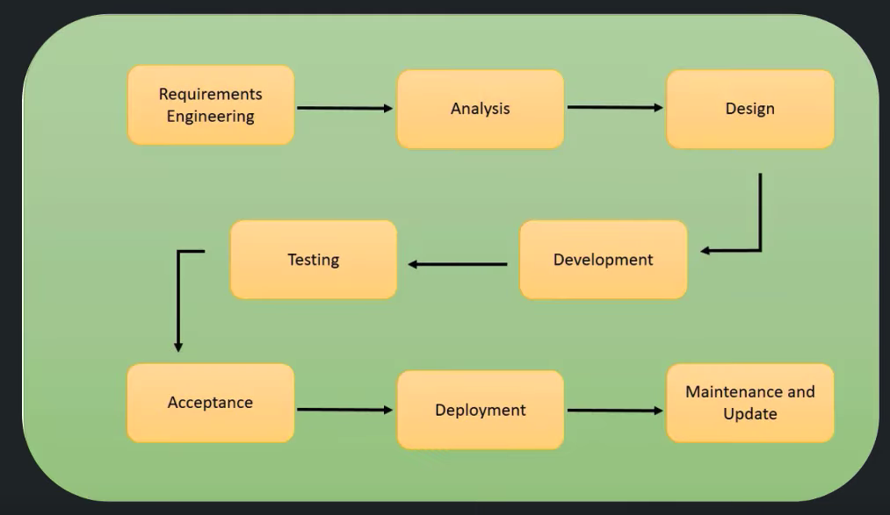
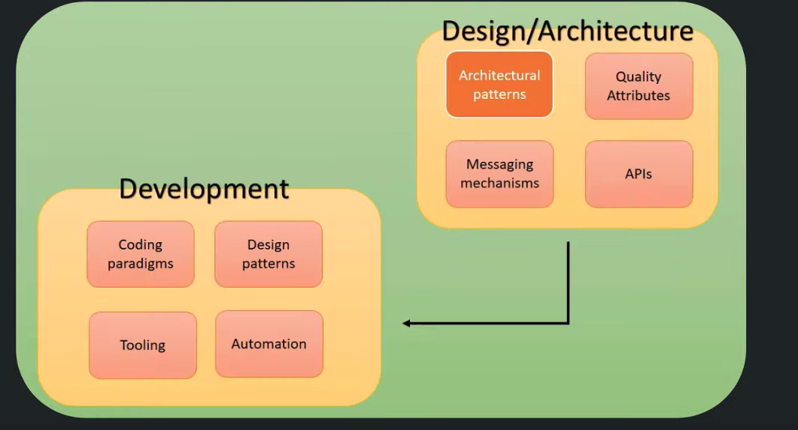
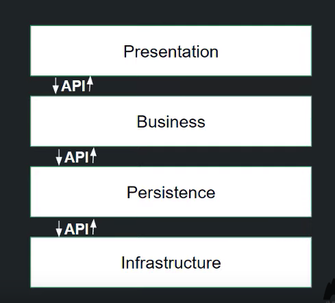
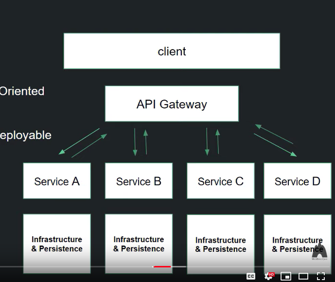
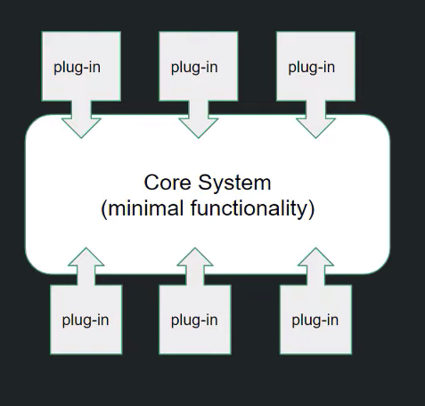
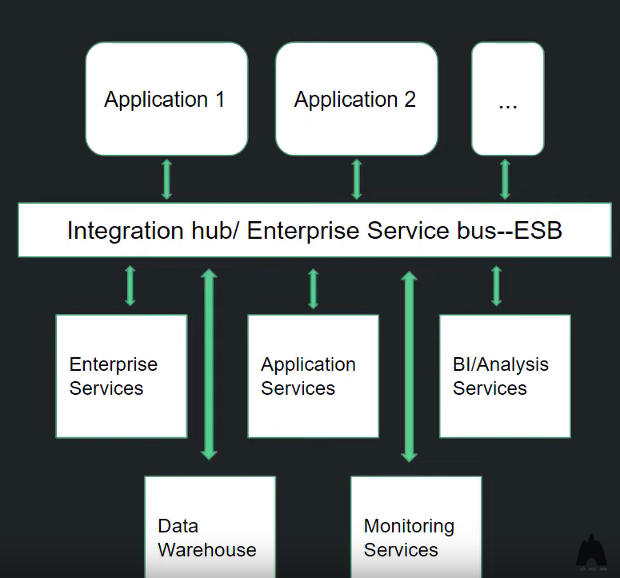
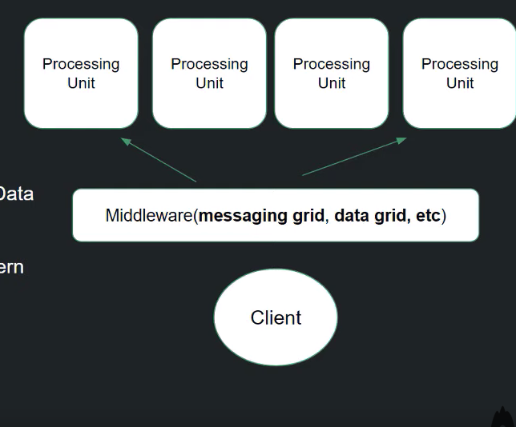

# Software Architecture Intro

## Why Software Architecture
* Building software is an activity that comprises many aspect of which coding is only a small portion
* Software Architecture is an aspect in Software Enginnering and Development

## Big Picture of Software Enginnering and Development

* Each yellow box is a phase, output of the previous phase is the input of the next phase
* **Requirement Enginnering** - Deals with business requirements and gathering info from stockhodler thats used to build the software
* **Analysis** - Process of taking info gathered and converting it to a meaningful form that would help software enginners start working on the software
* **Design** - Architecture of the software is defined and documented
* **Development** - Building and developing the software

## Design and Development Phase

* Architectural patterns, quality attributes, messaging mechanisms, and APIS should be determined in the design phase
* In some cases, you would define how they will manifest in code along with constraints
* The **design output** and **Architecture** is the **input of the development phase**

## Definition of Software Architecture
* Software Architecture is how the defining components of a software system are organized and assembled. How they communicate with each other. And the constraints the whole system is ruled by
1) **How the defining components of a software system are organized and assembled**
   - Known as the `Architectural Patterns`, the overall structure of the system
2) **How they communicate with each other**
   - `Interfaces` through which the components interact 
   - `Messaging Mechanism`
3) **Constraints the whole system is ruled by**
   - Known as` Non-Functional attributes` of the system
   - AKA `Quality attributes`
   - Ex: scalability, resolveablilty, resilience, adaptability
   - Quality attributes affects the architectural pattern choice and impact the development process

## Importance of Architectural Patterns
* The architectural pattern define the granularity of the components
* Knowing the architectural pattern will help us make good decision in development phase

## Difference Between Architectural Pattern and Design Pattern
* **Architectural Pattern**
  - High level, universal scope
  - How components are `organized` and `assembled`

* **Design Pattern**
  - Lower level scope
  - How components are `built`

## Types of Architectural Patterns
**1) Layered Architectural Pattern**

   - AKA N-tier pattern
   - Monolithic
   - Advocate separation of concerns
   - Software is divded into four layers
      1) Presentation
      2) Business
      3) Persistence
      4) Infrastrcture
   - Related functionalities are grouped together in closed modular layers
   - The system achieves its going through the communication of these layers via well defined interfaces (API)

**2) Microservices Architectural Pattern**

   - Service-based type of pattern
   - NOT Sertvice-Oriented Architecture 
   - Characterized by independently evolvable and deployable units
   - System doesn't break by adding or removing these units
   - The units form the whole system by some sort of coordination

**3) Event-Driven Architectural Pattern**
   - Distributed architecture
   - Consisted of event processing unit coordinated in a Mediator, or Broker topology 
   - Asynchronous nature, used for application that needs to be highly scalable and dynamic
   - Overall structure depends on the topology chosen

**4) MicroKernel Architectural Pattern**

   - AKA Plug-in architectural pattern
   - Has Two Major Components
      1) Core System - meant to have minimal functionality
      2) Plug-ins - used to customize the software and add features
   - Monolithic but highly flexible

**5) Service Oriented Architectural Pattern**

   - Used for large enterprise and complex system
   - Services in this pattern are **coarse-grained**
     - meaning they are bigger in scope, more abstract, and they are built up on each other
   - Used for integrating different heterogenous components 
   - Much wider scope than other patterns

**6) Space-based Architectural Pattern**

   - Hybrid of microservices, event driven, and computing science concept
   - It works through **Distributed Caching**
      - a in memory data grid that is shared among multiple processing units which are independent from each other 
   - The processing unit are managed by a middleware that has four core components 
      1) Messaging Grid
      2) Data Grid
      3) Processing Grid
      4) Deployment manager
   - Known for its elasticity in high scalability attributes
   - Ex: Cloud

## Additional Resources 
1) Software Architecture in Practice
2) Pattern Oriented Software Architecture

